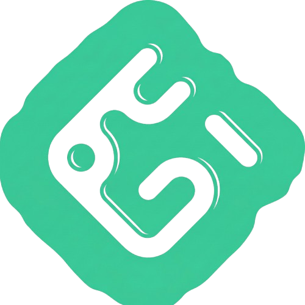

<div align="center">

<!-- ═══════════════════════════════════════════════════ HEADER ══ -->


<!-- ═══════════════════════════════════════════ PROFILE IMAGE ═══ -->
<br/>


<br/>

<!-- Glowing name badge -->

&nbsp;

&nbsp;


<br/><br/>

<!-- ══════════════════════════════════════════ TYPING ANIMATION ═ -->


<br/><br/>

<!-- ════════════════════════════════════════════════ BADGES ═════ -->
[](https://github.com/ahmedz182)
[](https://github.com/ahmedz182?tab=followers)
[](https://github.com/ahmedz182)

<br/>

<!-- ═════════════════════════════════════ ANIMATED DIVIDER ══════ -->


</div>

<br/>

## 👨‍💻 About Me

```typescript
const ahmed = {
  name:       "Muhammad Ahmed Fayyaz",
  role:       "Full-Stack Web Developer",
  company:    "Learn Hub Studio",
  based_in:   "Pakistan 🇵🇰",
  focus:      ["Web & Mobile Products", "Firebase-backed Apps", "Dev Tooling"],
  languages:  ["TypeScript", "JavaScript", "Python", "Java"],
  currently:  "Building precommit-sentinel & universal-pdf-gen 🔧",
  askMeAbout: ["React", "Next.js", "Firebase", "Flutter"],
};
```


## 🛠️ Tech Stack

<div align="center">

**Languages**


**Frontend**


**Backend & Data**


**Tools**

[](https://skillicons.dev)

</div>


## 🚀 Featured Projects

<div align="center">

| Project | Stack | Description |
|---|---|---|
| [**OLX-Clone**](https://github.com/ahmedz182/OLX-Clone) | Next.js · Firebase Auth | Marketplace app replicating OLX's listing, browsing & auth flows |
| [**React-Store-with-firebase**](https://github.com/ahmedz182/React-Store-with-firebase) | React · Firebase | E-commerce storefront with a Firebase-backed catalog |
| [**precommit-sentinel**](https://github.com/ahmedz182/precommit-sentinel) | JavaScript | Git pre-commit safety tooling |
| [**universal-pdf-gen**](https://github.com/ahmedz182/universal-pdf-gen) | Python | Lightweight PDF generation utility |
| [**Portfolio**](https://github.com/ahmedz182/Portfolio) | React | Personal developer portfolio site |

</div>


## 📊 GitHub Stats

<div align="center">


<br/>


<br/>

[](https://git.io/streak-stats)

</div>


## 📈 Contribution Graph

<div align="center">

[](https://github.com/ashutosh00710/github-readme-activity-graph)

<br/>

<picture>
  <source media="(prefers-color-scheme: dark)" srcset="https://raw.githubusercontent.com/ahmedz182/ahmedz182/output/github-snake-dark.svg" />
  <source media="(prefers-color-scheme: light)" srcset="https://raw.githubusercontent.com/ahmedz182/ahmedz182/output/github-snake.svg" />
  
</picture>

</div>


## ⚡ Recent Activity

<!--START_SECTION:activity-->
<!--END_SECTION:activity-->


## 🏆 Achievements

<div align="center">

[](https://github.com/ryo-ma/github-profile-trophy)

</div>


## 🤝 Connect With Me

<div align="center">

[](https://ahmedfayyaz.vercel.app/)
[](https://linkedin.com/in/ahmedz182)
[](https://twitter.com/learnhubstudio)
[](mailto:ahmedz182@gmail.com)
[](https://github.com/ahmedz182)

</div>

<br/>

<!-- ═════════════════════════════════════════════════ FOOTER ════ -->
<div align="center">




<br/>

*"First, solve the problem. Then, write the code."* — John Johnson

</div>
